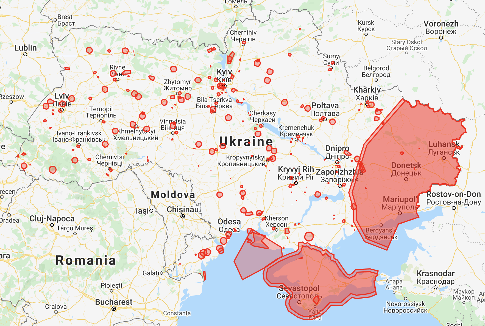

# Оминання перешкод безпілотними літальними апаратами

## Вступ

Важливим аспектом планування операції з використанням безпілотних літальних
апаратів (БПЛА) є оминання перешкод. Це є одним з розширень, характерних 
для класу задач про маршрутизацію БПЛА (також відому як Unmanned aircraft 
vehicles routing problem, UAVRP [1]). Залежно
від практичного застосування, це може бути зона, заборонена для польотів 
Державною авіаційною службою України [2], фізична перешкода, зона зі слабким
сигналом GPS тощо. 

_Рисунок 1: зони заборон та обмежень використання повітряного простору в Україні_

У поданій статті розглядаються лише ті 
перешкоди, розташування та область дії яких відомі на момент планування та що
можуть бути задані багатокутником на карті. 

## Постановка задачі

UAVRP описує етап планування операції з відвідування літальними апаратами 
встановлених цілей. Припускається, що з n пускових точок може бути випущено 
m літальних апаратів, кожен з яких характеризується можливою дальністю польоту. 
Існує k цілей, що мають бути відвідані хоча б одним з БПЛА. Кінцевою метою 
операції є відвідування одним з БПЛА кожної з цілей [3]. Це є одним з часткових
випадків задачі маршрутизації транспортних засобів (Vehicle routing problem, 
VRP) [4]. 

**+ Графова постановка**

Ключова ідея для реалізації оминання перешкод під час планування описаної 
операції полягає у незалежності представлення графу UAVRP від метричних
характеристик отриманого плану. Інакше кажучи, на вхід алгоритмам для побу-
дови плану операції подаються вершини та матриця відстаней між ними, без
урахування представлення маршруту на поверхні. Це дозволяє ввести додаткову
попередню обробку даних про цілі та загрози з метою обчислення найкоротших 
шляхів з оминанням загроз.

Тут множина цілей включає також точки вильоту та прильоту БПЛА, оскільки
між ними немає відмінностей з точки зору побудови допустимих шляхів.

_Рисунок 2: Приклад результату пошуку найкоротших допустимих шляхів_

На рисунку 2 зображено приклад таких шляхів для чотирьох цілей, позначених 
синіми крапками. Загрози позначені червоними багатокутниками, найкоротші
шляхи з дотриманням обмежень – помаранчевими лініями.

Таким чином, для побудови плану операції з оминанням загроз потрібно
виконати наступні кроки:
1. для кожної пари цілей побудувати найкоротші допустимі шляхи;
2. зберегти отримані шляхи для кожного з ребер графа, прийняти їх довжину
 як вагу відповідних ребер
3. розв'язати задачу пошуку оптимального плану з урахуванням скоригованої
 ваги ребер
4. замінити ребра у отриманому плані шляхами, асоційованими з цими ребрами
 на кроці 2

## Математична модель

Для кожної пари цілей має бути знайдено найкоротший допустимий шлях з 
оминанням загроз.

Вхідні дані:
 - кількість цілей N;
 - кількість загроз M;
 - масив загроз P, де P[i] - масив з послідовними координатами вершин 
 багатокутника, що обмежує зону дії загрози i (i = 1 to M);
 - масив цілей T, де T[i] - координати цілі i (i = 1 to N).

Вихідні дані:
 - D - матриця відстаней, де D[i][j] - відстань між цілями i та j 
 (i, j = 1 to N);
 - A - матриця шляхів, де А[i][j] - масив точок, що утворюють шлях між
 цілями i та j (i, j = 1 to N).
 
Для пошуку цих шляхів, потрібно виконати наступну послідовність дій:

##### 1. Побудувати множину відрізків K, що утворюють багатокутники загроз

Покладемо P' = P + P[1]

E = line(p[i], p[i+1]), (i = 1, N)  
 
##### 2. Побудувати граф видимості

D' - масив відрізків, що з'єднують цілі

Сформуємо множину усіх відрізків, що з'єднують цілі та вершини 
багатокутників загроз.
 
D[(i - 1) * N + j] = line(P[i], P[j]) (i = 1, N; j = 1, N)

D'' = d for d in D if not any(e.crosses(d) for e in E) 

##### 3. На графі видимості обчислити шляхи між кожною парою цілей

Обчислювальна складність: O(|E|\*|K| + N*log(N))

## Література

[1] UAVRP

[2] RESTRICTIONS MAP

[3] KM

[4] VRP